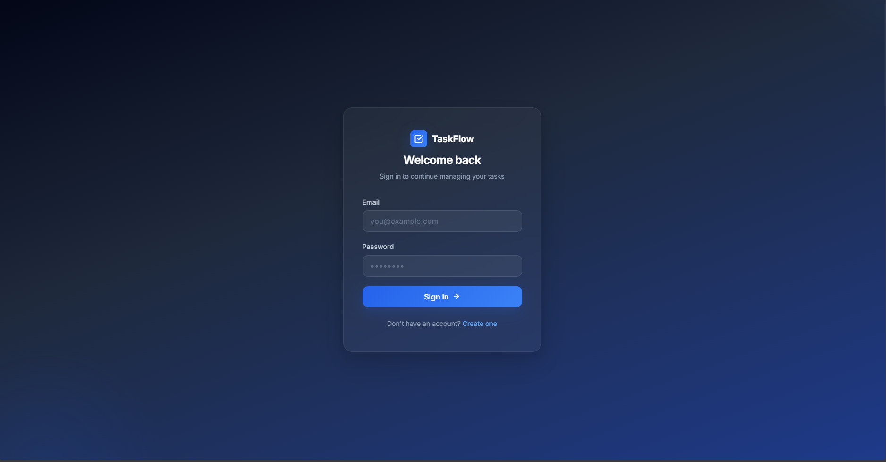
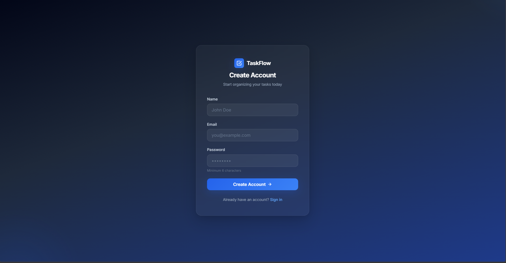
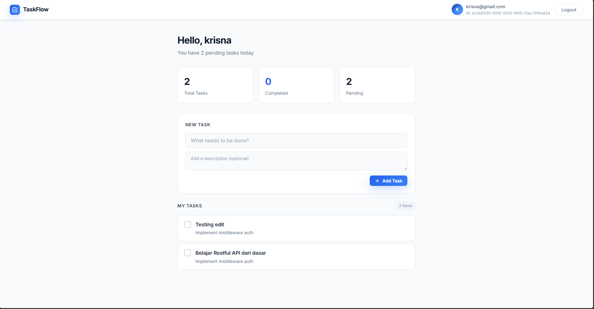
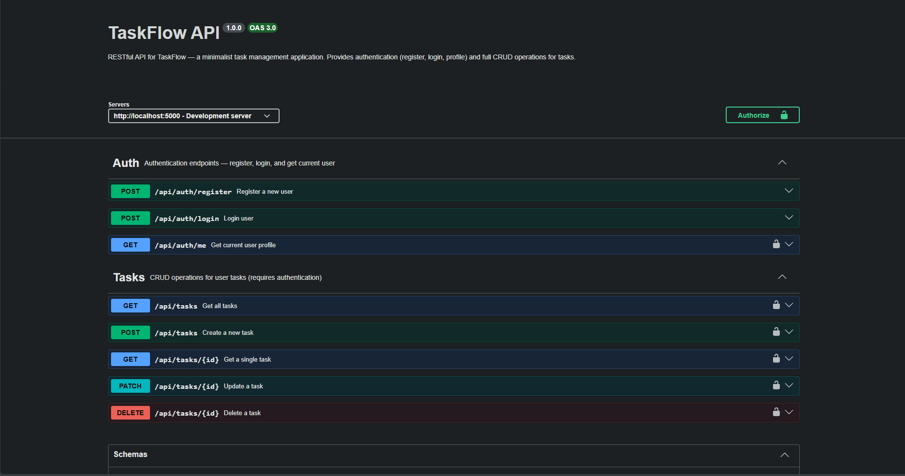

# ✅ TaskFlow

A Fullstack Task Management Application built with **React**, **Express.js**, **Supabase PostgreSQL**, and **JWT Authentication**.

TaskFlow follows RESTful API principles and provides secure authentication, authorization, and complete CRUD operations for task management. The project demonstrates frontend-backend integration using modern web development technologies.

---

## ✨ Features

### Authentication & Authorization

- User Registration with name, email, and password
- User Login with JWT token generation
- JWT-based Authentication on protected endpoints
- Protected Routes on the frontend (React Router)
- User-Based Resource Authorization (users can only access their own tasks)

### Task Management

- Create Task with title and optional description
- View All Tasks (sorted by newest first)
- View Task Details by ID
- Update Task (title, description, completed status)
- Delete Task
- Mark / Unmark Task as Completed

### API Documentation

- Interactive Swagger UI at `/docs`
- OpenAPI 3.0 specification at `/docs.json`
- Try-it-out functionality with JWT authentication

### Frontend Design

- Minimalist UI with blue, white, and black color palette
- Glassmorphism login & register cards
- Responsive layout for desktop and mobile
- Smooth micro-animations and hover effects
- Custom-styled checkboxes and task cards
- Google Fonts (Inter) typography

---

## 🛠️ Tech Stack

### Frontend

| Technology       | Purpose               |
| ---------------- | --------------------- |
| React 19         | UI library            |
| Vite 8           | Build tool & dev server |
| React Router DOM | Client-side routing   |
| Axios            | HTTP client           |
| Vanilla CSS      | Styling & animations  |

### Backend

| Technology          | Purpose                  |
| ------------------- | ------------------------ |
| Node.js             | Runtime environment      |
| Express.js 5        | Web framework            |
| JSON Web Token (JWT)| Authentication           |
| bcryptjs            | Password hashing         |
| Joi                 | Request validation       |
| swagger-jsdoc       | OpenAPI spec generation  |
| swagger-ui-express  | API documentation UI     |

### Database

| Technology          | Purpose                |
| ------------------- | ---------------------- |
| Supabase PostgreSQL | Cloud-hosted database  |

---

## 📁 Project Structure

```text
TaskFlow/
│
├── backend/
│   ├── src/
│   │   ├── config/
│   │   │   ├── supabase.js          # Supabase client configuration
│   │   │   └── swagger.js           # Swagger/OpenAPI specification
│   │   ├── controllers/
│   │   │   ├── auth.controller.js   # Register, login, me handlers
│   │   │   └── task.controller.js   # CRUD task handlers
│   │   ├── middlewares/
│   │   │   ├── auth.middleware.js    # JWT verification middleware
│   │   │   └── validate.middleware.js # Joi validation middleware
│   │   ├── routes/
│   │   │   ├── auth.routes.js       # Auth endpoint routes
│   │   │   └── task.route.js        # Task endpoint routes
│   │   ├── services/
│   │   │   ├── auth.service.js      # User database operations
│   │   │   └── task.service.js      # Task database operations
│   │   ├── utils/                   # Utility functions (hash, token)
│   │   ├── validations/
│   │   │   ├── auth.validation.js   # Register & login schemas
│   │   │   └── task.validation.js   # Create & update task schemas
│   │   └── app.js                   # Express app setup & middleware
│   │
│   ├── .env.example
│   ├── package.json
│   └── server.js                    # Server entry point
│
└── frontend/
    ├── src/
    │   ├── api/                     # Axios instance configuration
    │   ├── context/
    │   │   └── AuthContext.jsx       # JWT token state management
    │   ├── pages/
    │   │   ├── Login.jsx             # Login page with form
    │   │   ├── Register.jsx          # Register page with form
    │   │   └── Dashboard.jsx         # Task management dashboard
    │   ├── routes/
    │   │   ├── AppRoutes.jsx         # Route definitions
    │   │   └── ProtectedRoute.jsx    # Auth guard component
    │   ├── services/
    │   │   ├── auth.service.js       # Auth API calls
    │   │   └── task.service.js       # Task API calls
    │   ├── styles/
    │   │   └── global.css            # Design system & all styles
    │   └── main.jsx                  # App entry point
    │
    ├── index.html
    └── package.json
```

---

## 🏗️ System Architecture

```text
┌─────────────────────┐
│   React Frontend    │
│  (Vite Dev Server)  │
└────────┬────────────┘
         │ HTTP Requests
         ▼
┌─────────────────────┐
│  Axios HTTP Client  │
│  (Bearer Token)     │
└────────┬────────────┘
         │
         ▼
┌─────────────────────┐
│  Express REST API   │
│  (Port 5000)        │
├─────────────────────┤
│  JWT Auth Middleware │
│  Joi Validation     │
├─────────────────────┤
│  Swagger UI (/docs) │
└────────┬────────────┘
         │
         ▼
┌─────────────────────┐
│ Supabase PostgreSQL │
│  (Cloud Database)   │
└─────────────────────┘
```

---

## 🔌 RESTful API Endpoints

### Authentication

| Method | Endpoint             | Auth | Description                    |
| ------ | -------------------- | ---- | ------------------------------ |
| POST   | `/api/auth/register` | ❌   | Register a new user            |
| POST   | `/api/auth/login`    | ❌   | Login and receive JWT token    |
| GET    | `/api/auth/me`       | ✅   | Get current authenticated user |

### Tasks

| Method | Endpoint           | Auth | Description            |
| ------ | ------------------ | ---- | ---------------------- |
| GET    | `/api/tasks`       | ✅   | Get all user's tasks   |
| GET    | `/api/tasks/:id`   | ✅   | Get a single task      |
| POST   | `/api/tasks`       | ✅   | Create a new task      |
| PATCH  | `/api/tasks/:id`   | ✅   | Update a task          |
| DELETE | `/api/tasks/:id`   | ✅   | Delete a task          |

### Documentation

| Method | Endpoint     | Description                    |
| ------ | ------------ | ------------------------------ |
| GET    | `/docs`      | Swagger UI interactive docs    |
| GET    | `/docs.json` | Raw OpenAPI 3.0 JSON spec      |

---

## 🚀 Installation

### 1. Clone the Repository

```bash
git clone <repository-url>
cd TaskFlow
```

### 2. Backend Setup

Navigate to the backend directory:

```bash
cd backend
```

Install dependencies:

```bash
npm install
```

Create a `.env` file based on `.env.example`:

```env
PORT=5000

SUPABASE_URL=your_supabase_url

SUPABASE_KEY=your_supabase_key

JWT_SECRET=your_jwt_secret
```

Start the backend server:

```bash
npm run dev
```

The backend server will be available at:

```
http://localhost:5000
```

Swagger API Documentation:

```
http://localhost:5000/docs
```

---

### 3. Frontend Setup

Open a new terminal and navigate to the frontend directory:

```bash
cd frontend
```

Install dependencies:

```bash
npm install
```

Start the frontend development server:

```bash
npm run dev
```

The frontend application will be available at:

```
http://localhost:5173
```

---

## 🗄️ Database Schema

### Users Table

| Column     | Type        | Description          |
| ---------- | ----------- | -------------------- |
| id         | uuid (PK)   | Auto-generated UUID  |
| name       | text        | User's display name  |
| email      | text        | User's email address |
| password   | text        | Bcrypt hashed        |
| created_at | timestamptz | Auto-generated       |

### Tasks Table

| Column      | Type        | Description              |
| ----------- | ----------- | ------------------------ |
| id          | uuid (PK)   | Auto-generated UUID      |
| title       | text        | Task title (required)    |
| description | text        | Task description         |
| completed   | boolean     | Completion status        |
| user_id     | uuid (FK)   | References users.id      |
| created_at  | timestamptz | Auto-generated           |

### Relationship

```text
users (1) ────── (*) tasks
```

Each task belongs to a single user. Users can only access, modify, and delete their own tasks.

---

## 📖 API Documentation

Interactive API documentation is available through Swagger UI:

```
http://localhost:5000/docs
```

Swagger provides:

- Complete endpoint documentation with descriptions
- Request body schemas with examples
- Response schemas for all status codes (200, 201, 400, 401, 403, 404, 500)
- JWT Bearer authentication testing via the **Authorize** button
- Interactive "Try it out" functionality for all endpoints

The raw OpenAPI 3.0 JSON specification is also available at:

```
http://localhost:5000/docs.json
```

---

## 📸 Screenshots

### Login Page



### Register Page



### Dashboard



### Swagger API Documentation



---

## 📚 Learning Objectives

This project demonstrates the implementation of:

- RESTful API Design with proper HTTP methods and status codes
- JWT Authentication and token-based authorization
- Authorization Middleware for resource-level access control
- CRUD Operations with Supabase PostgreSQL
- React State Management with Context API
- Protected Routes on both frontend and backend
- Frontend–Backend Integration via Axios HTTP client
- Request Validation using Joi schemas
- API Documentation with Swagger / OpenAPI 3.0
- Modern CSS Design with glassmorphism and micro-animations

---

## 🔮 Future Improvements

- [ ] Search & filter tasks
- [ ] Pagination for task lists
- [ ] User profile management
- [ ] Dark mode toggle
- [ ] Task categories / labels
- [ ] Due dates and reminders
- [ ] Automated testing (Jest / Vitest)
- [ ] Docker deployment

---

## 👤 Author

**Krisna**

TaskFlow was developed as a Fullstack RESTful API project for learning modern web application development using React, Express.js, JWT Authentication, and Supabase PostgreSQL.
